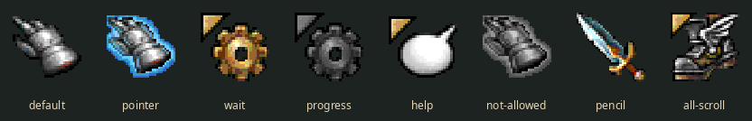

# Fellowship

Two Middle-earth themes for [Omarchy](https://omarchy.org): **Fellowship**,
the company on the ridge above Rivendell with the sun going down behind the
Misty Mountains, and **Fellowship Dawn**, the same world in daylight — vellum
and oak-gall ink.

Twelve wallpapers apiece, each cut to fit the panel it is shown on and each
carrying its own inscription in tengwar; a lock screen hewn out of Moria
stone; and an elvish line that runs along the top bar with the clock standing
inside it.


That is Frodo's greeting to Gildor — *elen síla lúmenn' omentielvo*, "a star
shines upon the hour of our meeting". The clock sits exactly where *lúmenn'*,
"upon the hour", belongs, so the bar reads as one sentence with the time
inside it. Click either half to read it in Latin letters; hover for the whole
line and its gloss.


The pointer is the Warcraft gauntlet, converted from the original Windows
cursors and wired to follow the theme:



---

## Install

```bash
git clone https://github.com/Dielerorn/omarchy-fellowship.git
cd omarchy-fellowship
./install.sh
```

That installs both themes, drops the tengwar bar module into
`~/.config/omarchy/bar/modules/`, places it either side of your clock, and
applies **Fellowship**. It never touches `/usr/share/omarchy`, and anything it
overwrites is backed up beside itself first.

```bash
./install.sh --help          # every option
./install.sh --no-wire       # install the bar module but leave shell.json alone
./install.sh --no-bar        # themes only
./install.sh --all           # also the Moria lock screen and the quiet screensaver
```

Then:

```bash
omarchy theme set fellowship        # Middle-earth at golden hour
omarchy theme set fellowship-dawn   # the same, in daylight
omarchy theme bg next               # walk the twelve plates
```

### Requirements

| | |
|---|---|
| Omarchy | any version with the Quickshell bar (`omarchy bar --help` works) |
| `ttf-tengwar-annatar` | **AUR** — `yay -S ttf-tengwar-annatar`. Needed for the bar module only. |
| `noto-fonts` | for the runes, if you rebuild the plates |
| ImageMagick + Python/Pillow | only to rebuild the plates |

The wallpapers have their inscriptions baked in, so they look right without
any font installed. The **bar module** cannot: Tengwar Annatar encodes the
tengwar at ordinary Latin code points, so without the font the line would
render as gibberish. It checks, and hides itself rather than show you that.

The font is freeware but its licence requires redistribution to carry the
whole original package unmodified, so it is **not** vendored here — install it
from the AUR.

---

## What is in the box

```
themes/fellowship/        the dark theme  — colours, 12 backgrounds, lock plate,
                          previews, hyprland.lua, and forge/ (the build pipeline)
themes/fellowship-dawn/   the light theme — the same twelve, reordered
bar/tengwar.qml           the bar module (generated; see forge/barwidget.py)
cursors/Fellowship-WoW/   the built XCursor theme
cursors/src/              the Windows .ani cursors it was built from
wallpapers/               the ten source illustrations, 1536x1024
plugins/                  optional: the Moria lock screen and the quiet screensaver
bin/                      the screensaver launchers, the cursor hook, and the
                          shell.json wiring helpers
```

> **This repository is private.** The wallpapers are original, but the cursors
> are Blizzard's World of Warcraft artwork. Keep it that way before sharing the
> link, or drop `cursors/` and publish the rest.

---

## The wallpapers, and fitting them to a panel

Ten source illustrations, all 3:2, plus an eleventh plate — Durin's Gate —
drawn from nothing by `forge/durin.py`. Twenty-two files per theme.

| plate | inscription | |
|---|---|---|
| Rivendell | *sinome maruvan* | here I will abide |
| Durin's Gate | ᛋᛈᛠᚳ᛫ᚠᚱᛁᛖᚾᛞ᛫ᚪᚾᛞ᛫ᛖᚾᛏᛖᚱ | speak friend and enter (futhorc) |
| Mordor | *undulávë lumbulë* | drowned deep in shadow |
| Balrog | *auta i lómë* | the night is passing |
| Wizards | *aiya Eärendil elenion ancalima* | hail Eärendil, brightest of stars |
| Gandalf | *elen síla lúmenn' omentielvo* | a star shines upon the hour of our meeting |
| Council | *aiya Eldalië ar Atanatári* | hail Elves and Fathers of Men |
| Treebeard | *yéni únótimë ve rámar aldaron* | long years numberless as the wings of trees |
| Rohirrim | *utúlie'n aurë* | day has come |
| Shire | *alassë ar sérë* | joy and peace |
| Tom | *laurië lantar lassi* | golden fall the leaves |

All but one are Tolkien's own Quenya. *alassë ar sérë* is built from attested
vocabulary rather than quoted, there being no canonical line that suits a
hobbit-hole.

Omarchy shows **one** wallpaper across every monitor and fills each with
`PreserveAspectCrop`, so a plate is only ever pixel-exact on panels of its own
aspect. Each scene therefore ships twice:

| file | pixels | fits |
|---|---|---|
| `NN-name.jpg` | 3840×2160 (16:9) | any 16:9 panel — 2560×1440, 1920×1080, 4K — with no crop at all |
| `NN-name-ultrawide.jpg` | 3440×1440 (21:9) | a 3440×1440 ultrawide exactly |

Pick whichever matches the monitor you care about and let the others crop. A
16:9 plate on a 21:9 panel keeps the middle 74.4% of its height; on a 32:9
panel, the middle 50%.

Nothing is cropped blind. The vellum posters cannot lose any height — it would
take the subject's head off — so instead their own empty left margin is
*grown*: a light profile is lifted from 80 real columns of parchment, softened
along its length, stretched across the new margin, re-grained, and the poster
cross-faded onto it over 1200px.

Two plates have no such margin. Rivendell and Mordor are full-bleed scenes, so
they are cropped instead, each with its own bias for where the crop window
sits: Rivendell at 42% keeps the company in frame, Mordor at 8% keeps the Eye,
which is near the top and would otherwise be the first thing a 21:9 crop threw
away.

Every poster carries a printed tengwar band whose script does not repeat
cleanly, so it cannot be tiled wider. Each plate gets a fresh band instead,
set in Tengwar Annatar, sized to cover the printed one exactly, and cut in
parchment or in umber depending on how dark the picture is.

---

## The cursors

The Warcraft gauntlet, and seven more roles from the same pack:

| X name | what it is |
|---|---|
| `default` | the silver gauntlet |
| `pointer` | the gauntlet, glowing blue — links and buttons |
| `wait` / `progress` | the gold and iron cogs |
| `help` | the orb |
| `not-allowed` | the gauntlet, greyed |
| `pencil` | the sword |
| `all-scroll` / `move` | the gryphon — a liberty, but you see this one dragging windows |

The pack has **no I-beam, no resize cursors, no crosshair**, and those are
cursors you meet constantly. The theme therefore declares `Inherits=Yaru` and
the missing roles come from Yaru, so text fields and window edges keep working
and simply do not look like Warcraft. Six more cursors — loot, mail, skinning,
and three character portraits — ship under `wow-*` names, bound to nothing.

### How it follows the theme

Omarchy's theme format has no cursor slot; it sets only `XCURSOR_SIZE`. So each
theme here carries a one-line `cursors.theme` file, in the same spirit as the
stock `icons.theme`, and `bin/fellowship-cursor` reads it. The installer
registers that script as **both** a `theme-set` and a `post-boot` hook, so the
cursor follows a theme switch immediately and survives a reboot without
anything being written into `hyprland.lua`.

Switch to a theme that names no cursor and you get the system default back.
Any Omarchy theme can opt in by dropping a `cursors.theme` in beside its
`icons.theme`.

### Rebuilding them

```bash
python3 themes/fellowship/forge/cursors.py cursors/src ~/.local/share/icons/Fellowship-WoW \
        --name Fellowship-WoW --inherits Yaru
```

`cursors.py` reads Windows `.ani`/`.cur` and writes XCursor directly — no
`win2xcur` or `xcursorgen` needed, just Pillow, which the forge already uses.
Two details it gets right that are easy to miss: under 32bpp the *AND mask* is
the transparency (Pillow's own CUR reader returns a fully opaque image), and
XCursor pixels are **premultiplied** ARGB, which matters at the soft edges
rescaling creates. The role table is `ROLES` near the bottom of the file.

---

## The writing

**Tengwar.** Quenya, in the tehtar mode: the vowel is a mark carried by the
*preceding* consonant, and long vowels and diphthongs ride carriers and glides
of their own.

Tengwar Annatar uses Daniel Smith's keyboard-position encoding — the tengwar
table from Appendix E laid over a US qwerty keyboard — so the strings are
deliberately "in the wrong places" and cannot sensibly be typed by hand.
`forge/tengwar.py` transcribes them instead, and refuses to hand anything back
until it has reproduced the transcription printed in the font's own manual:

```
sinome maruvan  ->  iT5^t$ t#7UyE5
```

which is the sample in table 1 of Johan Winge's documentation, not a string
derived here. Everything else in the theme — every band, the lock emblem, the
preview card, the bar — is transcribed through that same checked path.

Which tehta variant a vowel uses depends on how wide the tengwa beneath it is;
the widths were measured out of the font itself and fall into clean buckets,
and those buckets reproduce every letter of the fixture.

**Runes.** The dwarf-runes are Anglo-Saxon futhorc, which is what Tolkien
actually used for the dwarves in *The Hobbit* — Thrór's map and the
moon-letters are futhorc with a few of his own additions. Elder Futhark, the
usual stand-in, is the wrong alphabet.

---

## The bar module

`bar/tengwar.qml` is an ordinary Omarchy custom bar module. `install.sh` wires
it up for you; by hand it is two entries in `~/.config/omarchy/shell.json`
either side of `omarchy.clock`:

```json
{ "id": "tengwar-left",  "type": "qml",
  "source": "~/.config/omarchy/bar/modules/tengwar.qml",
  "phrase": "elen-sila" },
{ "id": "omarchy.clock", "format": "dddd HH:mm" },
{ "id": "tengwar-right", "type": "qml",
  "source": "~/.config/omarchy/bar/modules/tengwar.qml",
  "phrase": "omentielvo" }
```

`shell.json` hot-reloads, so there is nothing to restart.

| setting | |
|---|---|
| `phrase` | `elen-sila`, `omentielvo`, `sinome-maruvan`, `utulien-aure`, `auta-i-lome`, `namarie` |
| `size` | tengwar pixel size, default 17 |
| `opacity` | default 0.72 |
| `color` | defaults to the bar foreground |

To add a phrase of your own, put it in `PHRASES` in
`themes/fellowship/forge/barwidget.py` and regenerate:

```bash
python3 themes/fellowship/forge/barwidget.py ~/.config/omarchy/bar/modules/tengwar.qml
```

The module stands down — zero width, no gap — when the font is missing or the
bar is vertical.

---

## Optional extras

Both are clones of first-party Omarchy plugins, so installing them means that
part of your shell stops receiving upstream updates. Neither is installed
unless you ask.

```bash
./install.sh --with-lock    # the Moria lock plate + the tengwar emblem
./install.sh --with-idle    # a calm screensaver instead of the random effects
```

`--with-idle` covers both ways into the screensaver, which are separate: going
idle runs it through the cloned idle plugin, while the menu's Screensaver row
(Super+Space) calls stock `omarchy-launch-screensaver` and picks a random ttfx
effect. The installer repoints that row in
`~/.config/omarchy/extensions/omarchy-menu.jsonc` as well, reusing the stock id
so the icon and label are inherited, and leaving any rows of your own alone.

`--with-lock` is what makes `lockscreen.png` do anything: stock Omarchy blurs
the desktop wallpaper behind the lock screen, and this replaces it with a
plate of hewn stone shown sharp. It also stops the lock screen blanking the
displays after five seconds.

To go back to stock:

```bash
omarchy plugin remove "$USER.lock" && omarchy plugin enable omarchy.lock
omarchy restart shell
```

There is more on both, including a DPMS wake race worth knowing about on
NVIDIA, in [`themes/fellowship/README.md`](themes/fellowship/README.md).

---

## Rebuilding

```bash
cd themes/fellowship/forge
./forge.sh          # every background, preview and emblem, both themes
```

Needs ImageMagick, Python with Pillow, `ttf-tengwar-annatar`, `noto-fonts`,
and the ten source illustrations in `~/Pictures/Wallpapers/LOTR/` (override
with `SRC_DIR=`, or `./install.sh --with-wallpapers` to put them there).

`omarchy theme set` copies the theme to
`~/.local/state/omarchy/current/theme`, and the wallpaper, `omarchy theme bg
next` and the background switcher all read that snapshot rather than the theme
directory. A rebuild therefore shows up only once the theme is applied again —
`forge.sh` does that for you when one of these two is current, and restores
the wallpaper you had. By hand:

```bash
omarchy theme set fellowship && omarchy theme bg cache
```

Editing the plates, their inscriptions or their band tone is one table near
the bottom of `forge.sh`:

```bash
# slug : source : treatment : band tone : crop bias : the Quenya
PLATES=(
  "rivendell:Fellowship:scene:dark:42:sinome maruvan"
  "gandalf:Gandalf:poster:light:-:elen síla lúmenn omentielvo"
  ...
)
```

---

## Credits

The colours are lifted off the illustrations themselves; the palette, and
where each colour comes from, is documented in
[`themes/fellowship/README.md`](themes/fellowship/README.md).

- **Tengwar Annatar** — Johan Winge, 2005, freeware. Not redistributed here;
  install `ttf-tengwar-annatar` from the AUR.
- **Tengwar and futhorc** — J.R.R. Tolkien. A fan project, unaffiliated with
  and unendorsed by the Tolkien Estate.
- **Omarchy** — [omarchy.org](https://omarchy.org).

Everything in this repository that is mine is MIT; see [LICENSE](LICENSE). The
source illustrations in `wallpapers/` are included so the plates can be
rebuilt, and are not covered by it.
